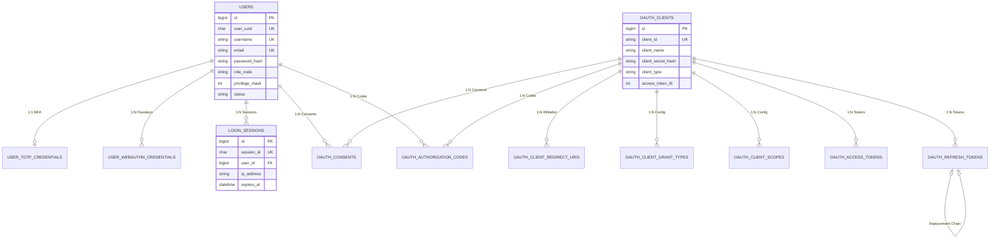

# 数据库架构设计 (MySQL)

本系统采用 MySQL 8.0 作为核心业务数据的持久化存储，遵循第三范式设计，并针对身份认证与 OAuth2 场景进行了深度优化。

## 1. 实体关系图 (ER Diagram)

以下是系统的核心数据模型及其关联关系：



## 2. 核心模块说明

系统主要分为四个模块：**用户与凭据**、**认证会话**、**OAuth2 协议实体** 以及 **系统审计**。

### 2.1 用户与身份 (User & Identity)
*   **`users`**: 核心用户表。存储 `user_uuid` (外部稳定标识)、加密后的 `password_hash`、`role_code` (RBAC 角色) 及 `privilege_mask` (32位权限位掩码)。
*   **`user_totp_credentials`**: 存储用户的 MFA (TOTP) 密钥。密钥通过 `enc:v1` (AES-GCM) 进行加密存储。
*   **`user_webauthn_credentials`**: 存储 Passkey/安全密钥的公钥及认证元数据。

### 2.2 认证会话 (Sessions)
*   **`login_sessions`**: 记录用户在浏览器端的登录态。包含 `acr` (认证上下文引用)、`amr` (认证方法引用，JSON 数组) 以及过期时间。
*   **`short_urls`**: 辅助模块，用于 MFA 绑定或设备流中的短链接转换。

### 2.3 OAuth2 / OIDC 协议层
*   **`oauth_clients`**: 注册的应用客户端。定义了 `client_type` (机密/公共)、`require_pkce`、`require_consent` 以及各类 Token 的 TTL。
*   **配置从表**：
    *   `oauth_client_redirect_uris`: 授权回调白名单。
    *   `oauth_client_grant_types`: 允许的授权模式（Code/Credentials/Refresh 等）。
    *   `oauth_client_scopes`: 允许申请的权限范围。
*   **票据与授权记录**：
    *   `oauth_consents`: 记录用户对某个 Client 授予的具体 Scopes，避免重复弹出授权页。
    *   `oauth_authorization_codes`: 授权码存储，关联 User 和 Session。
    *   `oauth_access_tokens`: 已签发的访问令牌元数据，用于撤回（Revocation）管理。
    *   `oauth_refresh_tokens`: 刷新令牌。支持 **Rotation (轮转)** 机制，通过 `replaced_by_token_id` 建立链式追踪。

## 3. 主从分离架构 (Read-Write Splitting)

为了应对高并发认证场景下的性能压力，系统底层实现了轻量级的数据库路由机制（Master-Slave 架构）。

### 3.1 路由策略 (DB Router)
系统在基础设施层 (`infrastructure/persistence`) 封装了 `dbRouter` 对象：
*   **Writer**: 专门负责所有的写操作（INSERT/UPDATE/DELETE）以及对实时性要求极高的事务。
*   **Reader**: 专门负责所有的只读操作（SELECT），可横向扩展多个只读节点。

### 3.2 代码实现模式
在 Repository 层中，操作会自动路由：
```go
// 示例：查询操作走 Reader
func (r *UserRepository) FindByUsername(ctx context.Context, username string) (*user.Model, error) {
    row := r.db.reader().QueryRowContext(ctx, query, username)
    // ...
}

// 示例：更新操作走 Writer
func (r *UserRepository) LockAccount(ctx context.Context, id int64) error {
    _, err := r.db.writer().ExecContext(ctx, query, id)
    return err
}
```

### 3.3 架构优势
1.  **读扩展**: 通过增加只读从库，可以线性提升 `/oauth2/authorize`、`/jwks.json` 和 `/.well-known/openid-configuration` 等只读端点的吞吐量。
2.  **稳定性**: 即使从库发生延迟，核心的令牌签发和状态更新操作在主库上依然保持原子性与一致性。
3.  **配置灵活**: 支持在环境变量中分别配置 `MYSQL_DSN` (主库) 和 `MYSQL_READ_DSN` (从库)。

## 4. 数据库设计亮点

1.  **稳定标识与内部主键分离**：所有表均使用自增 `id` 作为内部物理主键，同时对外部暴露 `uuid` 或 `client_id`。
2.  **SHA256 索引优化**：对于长 URL，计算并存储其 SHA256 哈希值建立唯一索引。
3.  **JSON 类型应用**：大量使用 MySQL 8.0 的 JSON 类型存储动态 Scopes 和元数据。
4.  **外键级联清理**：利用 `ON DELETE CASCADE` 确保用户注销或客户端删除时，票据数据自动物理清理。
