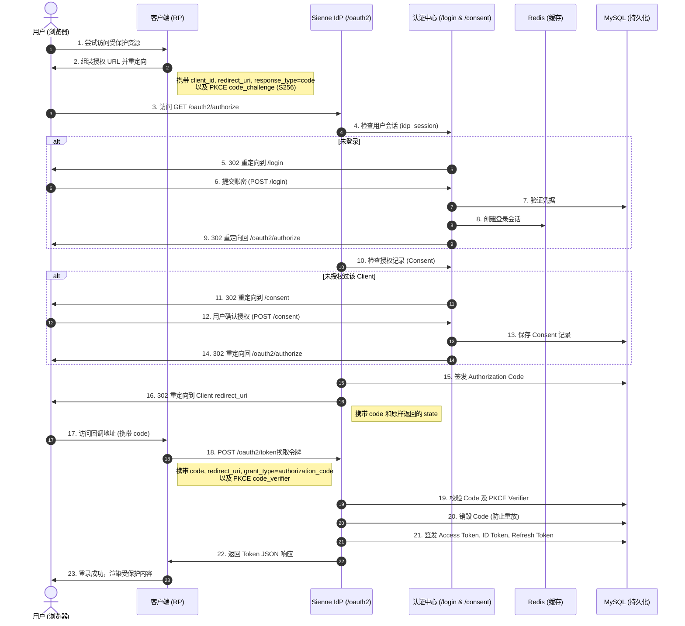

# 授权码模式 (Authorization Code) 流程

本时序图展示了第三方 Web 应用通过 `authorization_code` 模式配合 `PKCE` 获取用户授权并最终换取令牌的完整交互流程。

```mermaid
sequenceDiagram
    autonumber
    actor User as 用户 (浏览器)
    participant Client as 客户端 (RP)
    participant IDP as Sienne IdP (/oauth2)
    participant Auth as 认证中心 (/login & /consent)
    participant Redis as Redis (缓存)
    participant DB as MySQL (持久化)

    User->>Client: 1. 尝试访问受保护资源
    Client->>User: 2. 组装授权 URL 并重定向
    Note right of Client: 携带 client_id, redirect_uri, response_type=code<br/>以及 PKCE code_challenge (S256)

    User->>IDP: 3. 访问 GET /oauth2/authorize
    IDP->>Auth: 4. 检查用户会话 (idp_session)
    alt 未登录
        Auth->>User: 5. 302 重定向到 /login
        User->>Auth: 6. 提交账密 (POST /login)
        Auth->>DB: 7. 验证凭据
        Auth->>Redis: 8. 创建登录会话
        Auth->>User: 9. 302 重定向回 /oauth2/authorize
    end

    IDP->>Auth: 10. 检查授权记录 (Consent)
    alt 未授权过该 Client
        Auth->>User: 11. 302 重定向到 /consent
        User->>Auth: 12. 用户确认授权 (POST /consent)
        Auth->>DB: 13. 保存 Consent 记录
        Auth->>User: 14. 302 重定向回 /oauth2/authorize
    end

    IDP->>DB: 15. 签发 Authorization Code
    IDP->>User: 16. 302 重定向到 Client redirect_uri
    Note right of IDP: 携带 code 和原样返回的 state

    User->>Client: 17. 访问回调地址 (携带 code)
    Client->>IDP: 18. POST /oauth2/token换取令牌
    Note right of Client: 携带 code, redirect_uri, grant_type=authorization_code<br/>以及 PKCE code_verifier

    IDP->>DB: 19. 校验 Code 及 PKCE Verifier
    IDP->>DB: 20. 销毁 Code (防止重放)
    IDP->>DB: 21. 签发 Access Token, ID Token, Refresh Token
    IDP->>Client: 22. 返回 Token JSON 响应

    Client->>User: 23. 登录成功，渲染受保护内容
```
