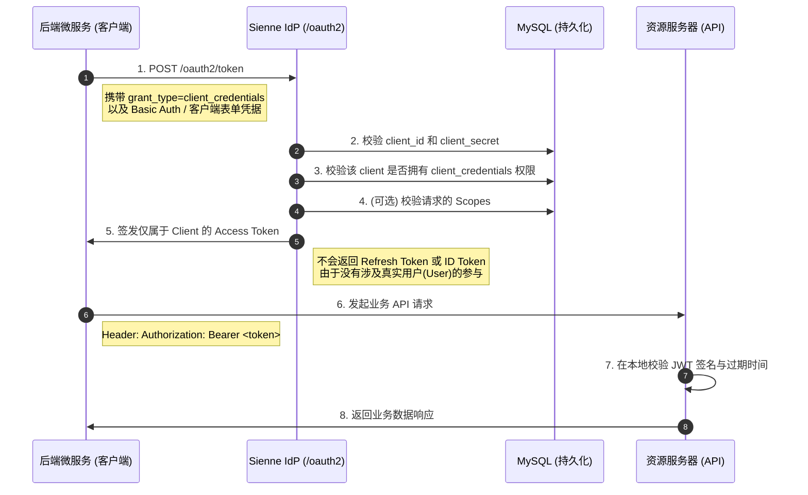

# 客户端凭据模式 (Client Credentials)

本时序图展示了后端机对机 (M2M) 场景下，私密微服务调用方凭借自身身份获取 Access Token 的流程。

```mermaid
sequenceDiagram
    autonumber
    participant ServiceA as 后端微服务 (客户端)
    participant IDP as Sienne IdP (/oauth2)
    participant DB as MySQL (持久化)
    participant Resource as 资源服务器 (API)

    ServiceA->>IDP: 1. POST /oauth2/token
    Note right of ServiceA: 携带 grant_type=client_credentials<br/>以及 Basic Auth / 客户端表单凭据

    IDP->>DB: 2. 校验 client_id 和 client_secret
    IDP->>DB: 3. 校验该 client 是否拥有 client_credentials 权限
    IDP->>DB: 4. (可选) 校验请求的 Scopes
    
    IDP->>ServiceA: 5. 签发仅属于 Client 的 Access Token
    Note right of IDP: 不会返回 Refresh Token 或 ID Token<br/>由于没有涉及真实用户(User)的参与

    ServiceA->>Resource: 6. 发起业务 API 请求
    Note right of ServiceA: Header: Authorization: Bearer <token>

    Resource->>Resource: 7. 在本地校验 JWT 签名与过期时间
    Resource->>ServiceA: 8. 返回业务数据响应
```
