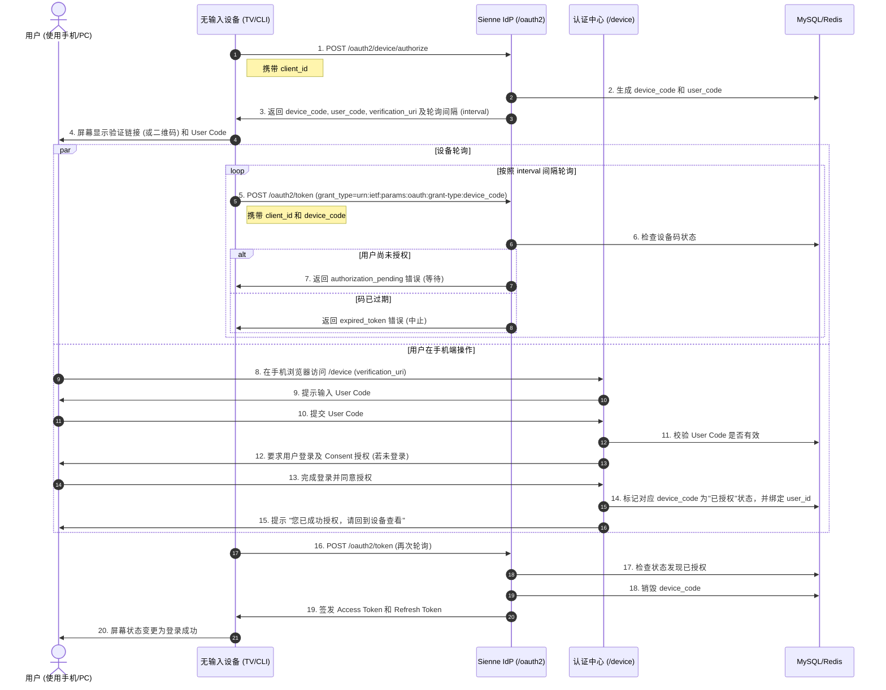

# 设备授权码流程 (Device Code Flow)

本时序图展示了无浏览器输入设备（如智能电视、CLI 工具）通过设备授权码流程获取令牌的全过程。

```mermaid
sequenceDiagram
    autonumber
    actor User as 用户 (使用手机/PC)
    participant TV as 无输入设备 (TV/CLI)
    participant IDP as Sienne IdP (/oauth2)
    participant Auth as 认证中心 (/device)
    participant DB as MySQL/Redis

    TV->>IDP: 1. POST /oauth2/device/authorize
    Note right of TV: 携带 client_id

    IDP->>DB: 2. 生成 device_code 和 user_code
    IDP->>TV: 3. 返回 device_code, user_code, verification_uri 及轮询间隔 (interval)

    TV->>User: 4. 屏幕显示验证链接 (或二维码) 和 User Code
    
    par 设备轮询
        loop 按照 interval 间隔轮询
            TV->>IDP: 5. POST /oauth2/token (grant_type=urn:ietf:params:oauth:grant-type:device_code)
            Note right of TV: 携带 client_id 和 device_code
            IDP->>DB: 6. 检查设备码状态
            alt 用户尚未授权
                IDP->>TV: 7. 返回 authorization_pending 错误 (等待)
            else 码已过期
                IDP->>TV: 返回 expired_token 错误 (中止)
            end
        end
    and 用户在手机端操作
        User->>Auth: 8. 在手机浏览器访问 /device (verification_uri)
        Auth->>User: 9. 提示输入 User Code
        User->>Auth: 10. 提交 User Code
        Auth->>DB: 11. 校验 User Code 是否有效
        Auth->>User: 12. 要求用户登录及 Consent 授权 (若未登录)
        User->>Auth: 13. 完成登录并同意授权
        Auth->>DB: 14. 标记对应 device_code 为"已授权"状态，并绑定 user_id
        Auth->>User: 15. 提示 "您已成功授权，请回到设备查看"
    end

    %% 下一次轮询时获取到令牌
    TV->>IDP: 16. POST /oauth2/token (再次轮询)
    IDP->>DB: 17. 检查状态发现已授权
    IDP->>DB: 18. 销毁 device_code
    IDP->>TV: 19. 签发 Access Token 和 Refresh Token
    TV->>User: 20. 屏幕状态变更为登录成功
```
