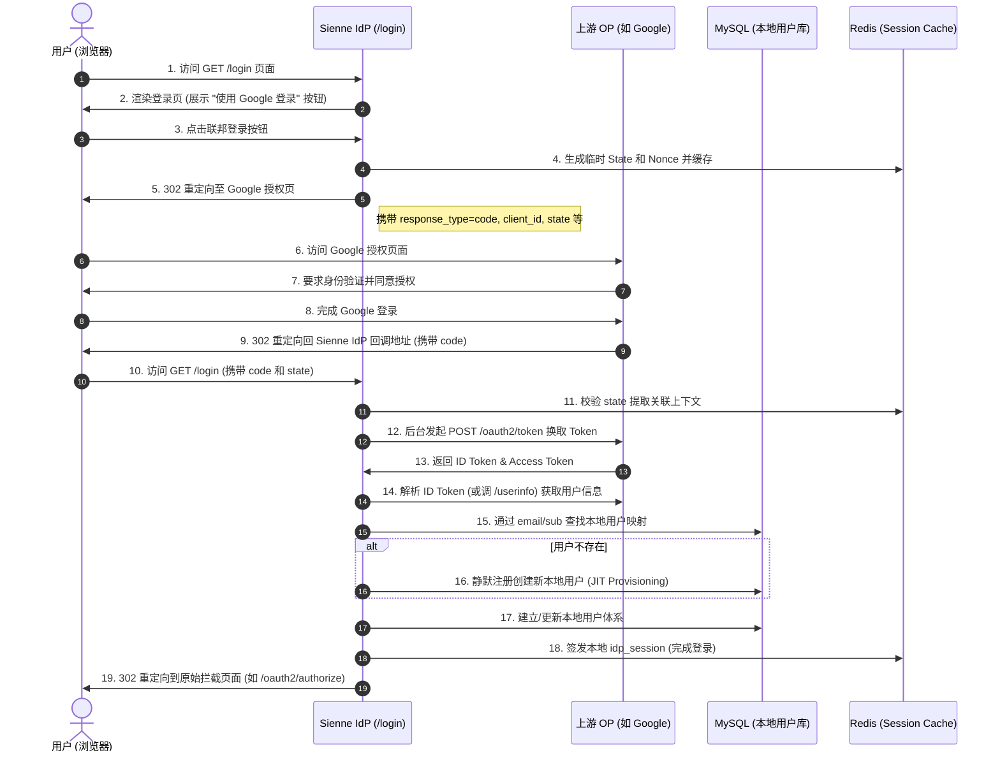

# 联邦 OIDC 登录流程 (Federated Login)

本时序图展示了用户在本地登录页选择使用第三方 OIDC 提供商（如 Google）进行登录的端到端联邦认证流程。

```mermaid
sequenceDiagram
    autonumber
    actor User as 用户 (浏览器)
    participant IDP as Sienne IdP (/login)
    participant Upstream as 上游 OP (如 Google)
    participant DB as MySQL (本地用户库)
    participant Redis as Redis (Session Cache)

    User->>IDP: 1. 访问 GET /login 页面
    IDP->>User: 2. 渲染登录页 (展示 "使用 Google 登录" 按钮)
    User->>IDP: 3. 点击联邦登录按钮
    IDP->>Redis: 4. 生成临时 State 和 Nonce 并缓存
    IDP->>User: 5. 302 重定向至 Google 授权页
    Note right of IDP: 携带 response_type=code, client_id, state 等

    User->>Upstream: 6. 访问 Google 授权页面
    Upstream->>User: 7. 要求身份验证并同意授权
    User->>Upstream: 8. 完成 Google 登录
    Upstream->>User: 9. 302 重定向回 Sienne IdP 回调地址 (携带 code)

    User->>IDP: 10. 访问 GET /login (携带 code 和 state)
    IDP->>Redis: 11. 校验 state 提取关联上下文
    IDP->>Upstream: 12. 后台发起 POST /oauth2/token 换取 Token
    Upstream->>IDP: 13. 返回 ID Token & Access Token
    IDP->>Upstream: 14. 解析 ID Token (或调 /userinfo) 获取用户信息

    IDP->>DB: 15. 通过 email/sub 查找本地用户映射
    alt 用户不存在
        IDP->>DB: 16. 静默注册创建新本地用户 (JIT Provisioning)
    end
    
    IDP->>DB: 17. 建立/更新本地用户体系
    IDP->>Redis: 18. 签发本地 idp_session (完成登录)
    IDP->>User: 19. 302 重定向到原始拦截页面 (如 /oauth2/authorize)
```
