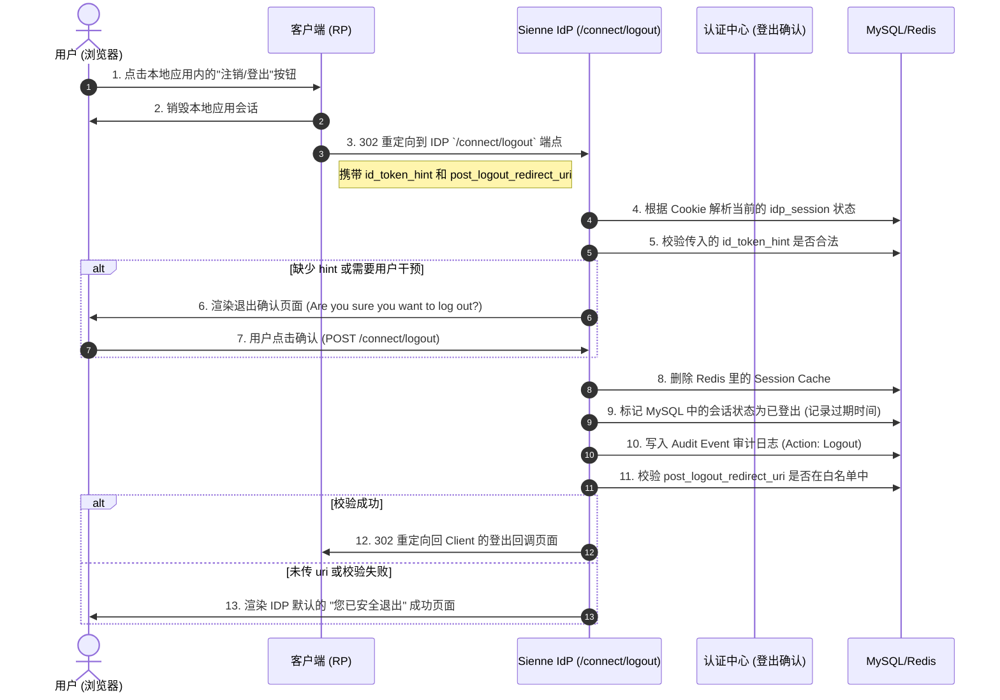

# 登出与会话销毁流程 (Logout)

本时序图展示了 RP（依赖方/第三方应用）主动发起 OIDC 协议的 `/connect/logout`，从而注销本地应用会话与 IdP 中心会话的全过程。

```mermaid
sequenceDiagram
    autonumber
    actor User as 用户 (浏览器)
    participant Client as 客户端 (RP)
    participant IDP as Sienne IdP (/connect/logout)
    participant Auth as 认证中心 (登出确认)
    participant DB as MySQL/Redis

    User->>Client: 1. 点击本地应用内的"注销/登出"按钮
    Client->>User: 2. 销毁本地应用会话
    Client->>IDP: 3. 302 重定向到 IDP `/connect/logout` 端点
    Note right of Client: 携带 id_token_hint 和 post_logout_redirect_uri

    IDP->>DB: 4. 根据 Cookie 解析当前的 idp_session 状态
    IDP->>DB: 5. 校验传入的 id_token_hint 是否合法
    
    alt 缺少 hint 或需要用户干预
        IDP->>User: 6. 渲染退出确认页面 (Are you sure you want to log out?)
        User->>IDP: 7. 用户点击确认 (POST /connect/logout)
    end

    IDP->>DB: 8. 删除 Redis 里的 Session Cache
    IDP->>DB: 9. 标记 MySQL 中的会话状态为已登出 (记录过期时间)
    IDP->>DB: 10. 写入 Audit Event 审计日志 (Action: Logout)
    
    IDP->>DB: 11. 校验 post_logout_redirect_uri 是否在白名单中
    alt 校验成功
        IDP->>Client: 12. 302 重定向回 Client 的登出回调页面
    else 未传 uri 或校验失败
        IDP->>User: 13. 渲染 IDP 默认的 "您已安全退出" 成功页面
    end
```
